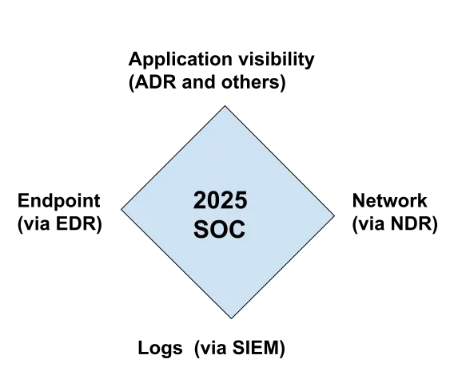
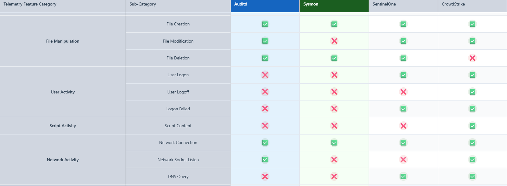
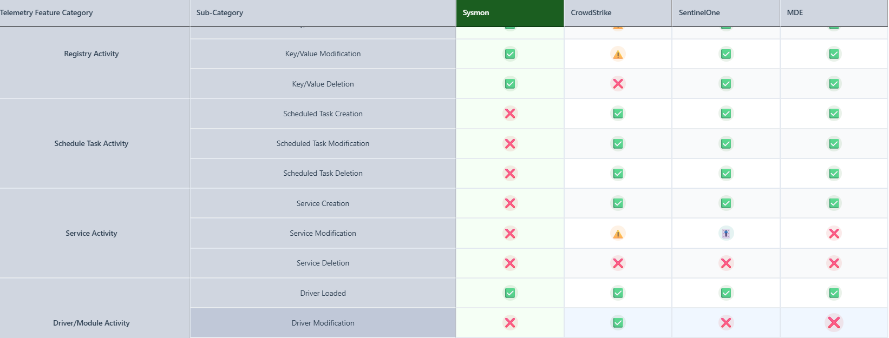

# Telemetry: The Foundation of Detection

## What is Telemetry?
Before detecting malicious activity, you first need data to detect on. **Telemetry** refers to the automated collection and transmission of data from remote sources. In security operations, this means logs, events, metrics, and traces from across your IT environment.

## The SOC Visibility Quad

### Evolution from Triad to Quad

The traditional **SOC Visibility Triad** consisted of three pillars:
1. **SIEM (Logs)** - Security Information and Event Management, collecting logs from various sources
2. **NDR (Network)** - Network Detection and Response, monitoring network traffic
3. **EDR (Endpoint)** - Endpoint Detection and Response, monitoring endpoint behavior

The **SOC Visibility Quad** adds a fourth critical pillar:
4. **ADR (Application)** - Application Detection and Response, monitoring application-layer activity

### The Four Pillars of Modern SOC Visibility

1. **Logs/SIEM** - Centralized log collection and correlation
   - Authentication events, system logs, audit trails
   - Cloud platform logs (AWS CloudTrail, Azure Activity Logs)
   - Identity provider logs (Okta, Entra ID)

2. **Network/NDR** - Network traffic analysis and threat detection
   - Traffic flows, connections, DNS queries
   - East-west and north-south traffic monitoring
   - Protocol analysis and anomaly detection

3. **Endpoint/EDR** - Host-based detection and response
   - Process execution, file operations, registry changes
   - Memory analysis and behavioral monitoring
   - Threat hunting on endpoints

4. **Application/ADR** - Application-level visibility and protection
   - SaaS application activity (M365, Salesforce, GitHub)
   - AI Agents reveal completely new attack avenues - see [PromptIntel](https://promptintel.novahunting.ai/feed)
   - API calls and data access patterns
   - User behavior within applications

## Types of Telemetry Sources

### Traditional Sources (Pre-2015)
- **Firewall logs** - Network traffic allow/deny decisions
- **Proxy logs** - Web traffic, URL filtering
- **VPN logs** - Remote access connections
- **Windows Event Logs** - Authentication, system events
- **Linux/Unix Syslog** - System and application events
- **IDS/IPS alerts** - Network-based threat detection
- **Antivirus logs** - Malware detection events

### Modern Telemetry Sources (Last 10 Years)

#### Endpoint Visibility
- **Sysmon** - Enhanced Windows event logging
- **EDR Telemetry** - Process trees, network connections, file modifications
  - EDR Telemetry project: https://www.edr-telemetry.com/
  - Examples: CrowdStrike, SentinelOne, Microsoft Defender for Endpoint

Endpoint sources of Sysmon and Auditd lack in the telemetry width that current EDRs have.

**Linux**: 

**Windows:**

Although this is the case, there is still value to using a Sysmon or Auditd to fix the shortcomings of your org's EDR solution. 
- Example: Crowdstrike does not reliably log Windows Registry events, while Sysmon does. This can prove to be invaluable data for detection and investigation purposes that might make pairing Crowdstrike Falcon with Sysmon a necessity for certain orgs.
- Example 2: Driver and image loading events are not logged by any of the major EDR solutions, but they are by Auditd. Showing the importance of collecting non-EDR logs from endpoints for a more complete telemetry coverage.

#### Cloud Infrastructure
- **AWS CloudTrail** - API activity logging
- **Azure Activity Logs** - Resource management events
- **GCP Cloud Audit Logs** - Admin and data access events
- **VPC Flow Logs** - Network traffic in cloud environments
- **Cloud resource configuration logs**

#### Identity & Access
- **Identity Provider Logs** - Okta, Ping Identity, Entra ID (Azure AD)
- **SSO events** - Single sign-on authentication flows
- **Privileged Access Management** - Admin session recordings
- **Multi-factor authentication** - MFA challenges and responses

#### SaaS Applications
- **Microsoft 365 / Office 365** - Email, SharePoint, Teams activity
- **Google Workspace** - Gmail, Drive, Admin console
- **Salesforce** - CRM data access and modifications
- **GitHub/GitLab** - Code repository changes
- **Slack/Teams** - Collaboration platform events

#### DevOps & Infrastructure
- **Container orchestration** - Kubernetes audit logs, pod events
- **CI/CD pipelines** - Jenkins, GitHub Actions, GitLab CI
- **Infrastructure as Code** - Terraform, CloudFormation executions
- **Container runtime** - Docker events, image pulls

#### Emerging Sources
- **Enterprise browser logs** - Managed browser telemetry
- **Application performance monitoring** - APM traces
- **Zero Trust Network Access** - ZTNA session logs
- **Secure Access Service Edge** - SASE platform events

## The Output-Driven SIEM Philosophy

### Key Principle
**Do not collect ANYTHING into your SIEM until you know how it will be used.**

### Before Collecting, Ask:
1. **What detection use case does this support?**
2. **Will this data appear in:**
   - Security alerts or detections?
   - Dashboards or visualizations?
   - Reports for compliance or leadership?
   - UEBA/behavioral analytics training?
   - Threat hunting workflows?
3. **What is the retention requirement?**
4. **What is the volume and cost impact?**

### Data Tiering Strategy

#### Hot Storage (SIEM)
- Data actively used for real-time detection
- Fast query performance required
- Examples: Authentication logs, EDR alerts, firewall denies

#### Warm Storage (Data Lake)
- Forensic and investigation value
- Slower queries acceptable
- Examples: Full packet capture, verbose application logs

#### Cold Storage (Archive)
- Compliance and long-term retention
- Rarely accessed
- Examples: Historical logs beyond active retention period

## Telemetry Quality Metrics

When evaluating telemetry sources, consider:

### Fidelity
- Does it capture the full event context?
- Are there gaps or blind spots?
- Is timestamp accuracy sufficient?

### Volume
- How much data is generated?
- Can your infrastructure handle it?
- What's the cost per GB?

### Latency
- How quickly does data arrive?
- Is near real-time detection possible?
- What's the delay from event to visibility?

### Reliability
- Are there collection failures?
- Is data loss acceptable?
- How do you monitor collection health?

## Key Takeaways

- **Start with use cases, not data sources**
- **Map telemetry to threat detection frameworks**
- **Implement data tiering to control costs**
- **Monitor collection health and data quality**
- **Regularly assess coverage gaps**

### References
https://medium.com/anton-on-security/one-more-time-on-siem-telemetry-log-sources-b0a88572dac9
https://medium.com/anton-on-security/soc-visibility-triad-is-now-a-quad-soc-visibility-quad-2025-72811401073a
https://medium.com/anton-on-security/output-driven-siem-13-years-later-c549370abf11
https://blog.securitybreak.io/introducing-promptintel-1624d03045a3

*If it isn't obvious, Anton Chauvkin's content is great.*