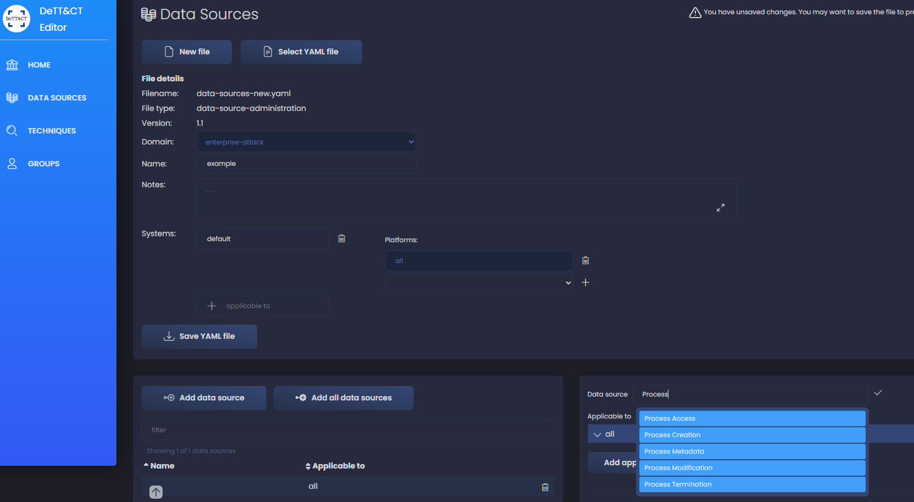
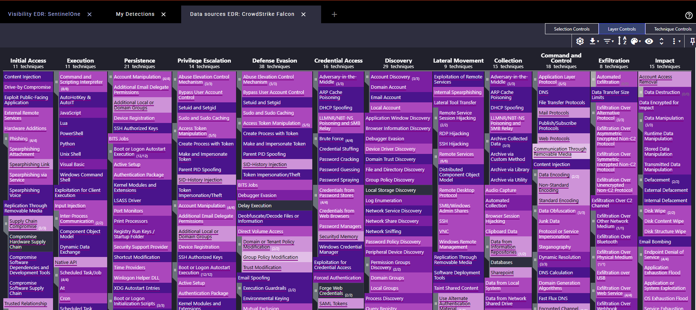
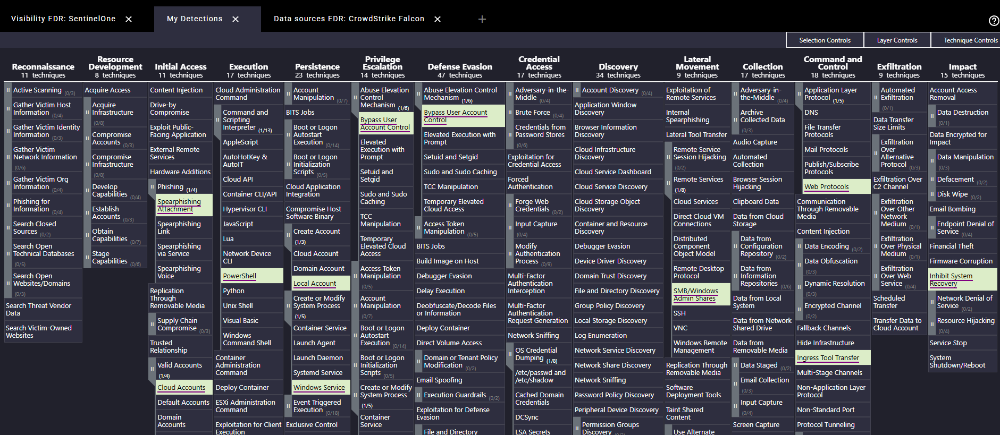
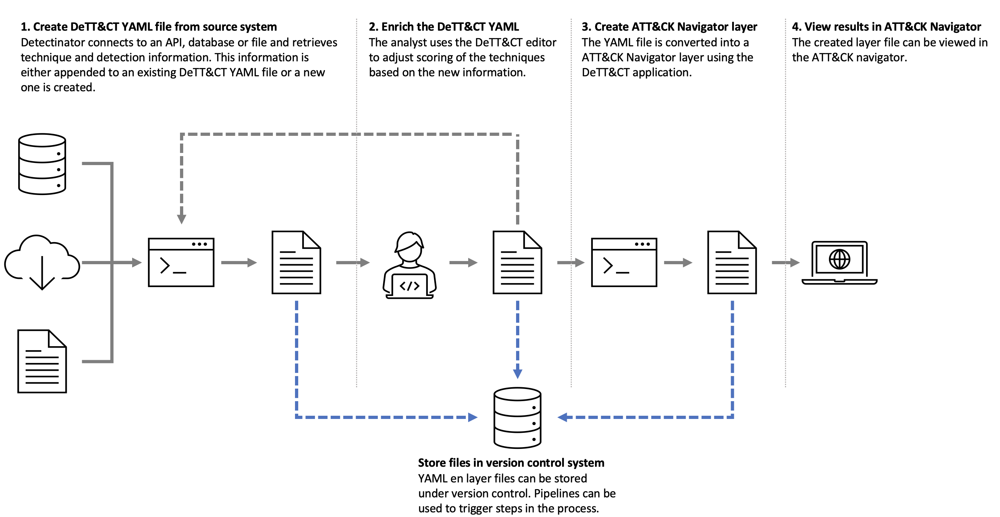

# LAB: Mapping Your Organization's Telemetry with DeTT&CT

## Overview

In this hands-on lab, you'll learn to use **DeTT&CT** (Detect Tactics, Techniques & Combat Threats), an open-source tool for mapping your organization's log sources to the MITRE ATT&CK framework. This helps you:

- Identify visibility gaps in your detection coverage
- Prioritize telemetry collection efforts
- Communicate security posture to leadership

**Not to be confused with**: MITRE D3FEND (a framework for defensive cybersecurity countermeasures)

**DeTT&CT focuses on**: Mapping data sources and detections to MITRE ATT&CK techniques

## What is DeTT&CT?

DeTT&CT is an open-source tool developed by Rabobank CDC that helps blue teams:
- Map available data sources to ATT&CK techniques
- Score the quality and visibility of data sources
- Visualize coverage using ATT&CK Navigator layers
- Identify gaps in detection capabilities

**Repository**: https://github.com/rabobank-cdc/DeTTECT

## Lab Setup (Time Estimate ~10 min)

You can install DeTT&CT using either **Docker** (recommended for quickest setup) or **Python** (manual installation).

<details>
<summary><b>🐳 Option A: Install with Docker (Recommended - Fastest)</b></summary>

### Option A: Install with Docker (Recommended - Fastest)

**Prerequisites**: Docker Desktop installed and running

**Don't have Docker?** Download and install Docker Desktop:
- **Windows/Mac**: https://www.docker.com/products/docker-desktop/
- **Linux**: Follow instructions at https://docs.docker.com/engine/install/
- After installation, start Docker Desktop and wait for it to finish starting up

1. Pull the official DeTT&CT Docker image:
```bash
cd ~
docker pull rabobankcdc/dettect:latest
```

2. Create and start the DeTT&CT container:

**Linux / macOS:**
```bash
docker run -p 8080:8080 -v $(pwd)/output:/opt/DeTTECT/output -v $(pwd)/input:/opt/DeTTECT/input --name dettect -it rabobankcdc/dettect:latest /bin/bash
```

**Windows Command Prompt (cmd.exe):**
```cmd
docker run -p 8080:8080 -v %cd%/output:/opt/DeTTECT/output -v %cd%/input:/opt/DeTTECT/input --name dettect -it rabobankcdc/dettect:latest /bin/bash
```

**Windows PowerShell:**
```powershell
docker run -p 8080:8080 -v ${PWD}/output:/opt/DeTTECT/output -v ${PWD}/input:/opt/DeTTECT/input --name dettect -it rabobankcdc/dettect:latest /bin/bash
```

**Note**: This command:
- Maps port 8080 for web access
- Creates `input/` and `output/` directories for file sharing
- Starts an interactive bash shell inside the container

1. You're now inside the DeTT&CT container! Proceed to **Launch DeTT&CT** below.

**To restart the container later** (if you exit):
```bash
docker start -i dettect
```

</details>

---

<details>
<summary><b>🐍 Option B: Install with Python (Manual)</b></summary>

### Option B: Install with Python (Manual)

**Prerequisites**: Python 3.8+, pip, and Git installed

1. Open a terminal and navigate to your home directory:
```bash
cd ~
```

2. Clone the DeTT&CT repository:
```bash
git clone https://github.com/rabobank-cdc/DeTTECT.git
cd DeTTECT
```

   **Alternative - Use pre-downloaded archive**: If you prefer, extract `files/DeTTECT-2.1.0.zip` to your home directory and `cd` into the extracted folder.

3. **(Optional but recommended)** Create a Python virtual environment:
```bash
# On Windows (Git Bash)
python -m venv venv
source venv/Scripts/activate

# On Linux/Mac
python -m venv venv
source venv/bin/activate
```

4. Install required Python libraries:
```bash
pip install -r requirements.txt
```

</details>

---

### Launch DeTT&CT

1. Start the DeTT&CT editor:
```bash
python dettect.py e
```

2. The DeTT&CT web interface should automatically open in your browser at `http://localhost:8080`

3. You should see the DeTT&CT home screen:


**Note**: If the browser doesn't open automatically, manually navigate to `http://localhost:8080`

## Exercise 1: Create Your Data Source Inventory (Time Estimate 5-60 min)

### Scenario
You're a detection engineer documenting your organization's telemetry sources. This exercise will help you create a visibility map of your real-world security telemetry to identify gaps.

### Step 0: Gather Your Organization's Telemetry Information

Before starting, you need to know what data sources your organization actually collects. Choose your approach:

<details>
<summary><b>⚡ Quick Start: Use Pre-Made EDR Files (Recommended to Start)</b></summary>

#### ⚡ Quick Start: Use Pre-Made EDR Files (Recommended to Start)

If you use one of these EDRs, we've done the initial work for you! Check the `files/examples/` directory in this lab folder:

- `premade_dettect_crowdstrike.yaml` - CrowdStrike Falcon telemetry
- `premade_dettect_mde.yaml` - Microsoft Defender for Endpoint telemetry
- `premade_dettect_sentinelone.yaml` - SentinelOne telemetry

**To use a premade file:**

1. In the DeTT&CT interface, click **"DATA SOURCES"** in the left navigation menu
2. Click the **"Select YAML file"** button
3. Navigate to and select your premade file from `files/examples/` directory
4. The file will load with all data sources pre-configured
5. Review and adjust quality scores based on YOUR actual deployment coverage
6. **Important**: Come back to the "Comprehensive Approach" section below to add your other data sources (network, cloud, identity, etc.)

**Next step after loading a premade file**: Skip to Exercise 2 to generate your initial visibility heatmap, then return to add additional data sources.

</details>

<details>
<summary><b>🎯 Comprehensive Approach: Full Telemetry Inventory (Most Accurate)</b></summary>

#### 🎯 Comprehensive Approach: Full Telemetry Inventory (Most Accurate)

Document what your organization actually collects by category. This is the recommended approach for a complete and accurate telemetry map.

**Step 1: Identify Your EDR Coverage**

Visit **https://www.edr-telemetry.com/** to see detailed telemetry mappings for your EDR platform:
- CrowdStrike Falcon
- Microsoft Defender for Endpoint (MDE)
- SentinelOne
- Carbon Black
- Cortex XDR
- Trellix
- And many more...

This site shows exactly which ATT&CK data sources and sub-data sources each EDR provides. Use this to understand what your EDR gives you out of the box.

**Step 2: Inventory Your Other Telemetry Sources**

Work through the complete data source list below and for each one, ask yourself:

1. **Do we collect this?** (Yes/No)
2. **What product/service provides it?** (e.g., EDR, Firewall, CloudTrail, Active Directory)
3. **What's the quality?** (Coverage %, timeliness, retention)
4. **Where does it go?** (SIEM, data lake, log aggregator)

**Use this table to document your findings as you go:**

| Data Source | Collected? | Product(s) | Device Coverage | Quality Notes |
|-------------|------------|------------|-----------------|---------------|
| Process Creation | ✅ Yes | CrowdStrike EDR | 100% of endpoints | Real-time, all fields |
| Command Execution | ✅ Yes | CrowdStrike EDR | 100% of endpoints | Real-time, full command lines |
| Network Traffic Flow | ✅ Yes | Palo Alto Firewall, AWS VPC Flow | 100% of network | 5min delay, 30 day retention |
| File Creation | ✅ Yes | CrowdStrike EDR | 100% of endpoints | Real-time |
| Windows Event Logs | ⚠️ Partial | Windows Event Forwarding | Only servers (not workstations) | Need to expand |
| PowerShell Logs | ❌ No | - | 0% | Need to enable Script Block Logging |
| Email Gateway | ❌ No | - | 0% | Critical gap - no email visibility |
| ... | ... | ... | ... | ... |

**Step 3: Reference the Complete DeTT&CT Data Source List**

Below is a complete list of all data sources in DeTT&CT. Use this as your checklist:

<details>
<summary><b>📋 Click to expand: Complete list of DeTT&CT Data Sources (115 total)</b></summary>

The "Count" column represents the number of MITRE ATT&CK (sub)techniques covered by each data source. Higher counts indicate data sources that provide visibility into more techniques.

| Count | Data Source |
|-------|-------------|
| 255 | Command Execution |
| 206 | Process Creation |
| 98 | File Modification |
| 88 | File Creation |
| 82 | Network Traffic Flow |
| 78 | OS API Execution |
| 70 | Network Traffic Content |
| 58 | Windows Registry Key Modification |
| 58 | Network Connection Creation |
| 55 | Application Log Content |
| 50 | Module Load |
| 46 | File Access |
| 46 | Web [DeTT&CT data source] |
| 37 | File Metadata |
| 32 | Logon Session Creation |
| 26 | Script Execution |
| 22 | Response Content |
| 21 | Internal DNS [DeTT&CT data source] |
| 20 | User Account Authentication |
| 18 | Process Access |
| 17 | Windows Registry Key Creation |
| 17 | Email [DeTT&CT data source] |
| 15 | Service Creation |
| 15 | Host Status |
| 13 | Active Directory Object Modification |
| 12 | Service Metadata |
| 11 | Process Metadata |
| 10 | Driver Load |
| 10 | File Deletion |
| 9 | Firmware Modification |
| 9 | Logon Session Metadata |
| 9 | Process Modification |
| 8 | User Account Metadata |
| 7 | Windows Registry Key Access |
| 7 | Scheduled Job Creation |
| 7 | Malware Metadata |
| 7 | Active Directory Credential Request |
| 6 | Container Creation |
| 6 | Web Credential Usage |
| 6 | Response Metadata |
| 6 | User Account Creation |
| 6 | Drive Modification |
| 6 | User Account Modification |
| 5 | Instance Creation |
| 5 | Active DNS |
| 5 | Passive DNS |
| 5 | Network Share Access |
| 5 | Drive Access |
| 5 | Service Modification |
| 4 | Image Creation |
| 4 | Instance Start |
| 4 | Active Directory Object Creation |
| 4 | Malware Content |
| 4 | Social Media |
| 4 | Domain Registration |
| 4 | Drive Creation |
| 4 | Windows Registry Key Deletion |
| 3 | Active Directory Object Access |
| 3 | Instance Metadata |
| 3 | Container Start |
| 3 | Web Credential Creation |
| 3 | Firewall Rule Modification |
| 3 | Firewall Disable |
| 3 | Instance Deletion |
| 3 | Snapshot Creation |
| 3 | Process Termination |
| 2 | Cloud Storage Enumeration |
| 2 | Cloud Storage Access |
| 2 | Pod Metadata |
| 2 | Active Directory Object Deletion |
| 2 | Cloud Service Modification |
| 2 | Cloud Service Disable |
| 2 | Certificate Registration |
| 2 | Cloud Storage Metadata |
| 2 | Instance Modification |
| 2 | Instance Stop |
| 2 | Firewall Metadata |
| 2 | Firewall Enumeration |
| 2 | Group Enumeration |
| 2 | Group Metadata |
| 2 | Image Metadata |
| 2 | Scheduled Job Metadata |
| 2 | Scheduled Job Modification |
| 2 | Kernel Module Load |
| 2 | WMI Creation |
| 2 | Group Modification |
| 2 | Driver Metadata |
| 2 | Snapshot Modification |
| 2 | Snapshot Deletion |
| 2 | Volume Deletion |
| 2 | Cloud Storage Modification |
| 2 | Cloud Service Enumeration |
| 1 | Cluster Metadata |
| 1 | Container Enumeration |
| 1 | Container Metadata |
| 1 | Pod Enumeration |
| 1 | Pod Creation |
| 1 | Pod Modification |
| 1 | Instance Enumeration |
| 1 | Snapshot Metadata |
| 1 | Snapshot Enumeration |
| 1 | Volume Metadata |
| 1 | Volume Enumeration |
| 1 | Named Pipe Metadata |
| 1 | User Account Deletion |
| 1 | Image Modification |
| 1 | Volume Creation |
| 1 | Volume Modification |
| 1 | Cloud Storage Creation |
| 1 | Cloud Service Metadata |
| 1 | Image Deletion |
| 1 | Cloud Storage Deletion |
| 1 | DHCP [DeTT&CT data source] |

</details>

</details>

### Step 1: Create a New Data Sources File

1. In the DeTT&CT interface, click **"DATA SOURCES"** in the left navigation menu

2. Click the **"New file"** button

3. You'll see a blank data sources YAML file template

### Step 2: Add Your Data Sources

Now you'll add **your organization's actual data sources** based on what you collected in Step 0.

1. Click **"Add data source"** button

2. In the **"Data source"** field on the right panel, start typing to search for a data source. The data source names match MITRE ATT&CK's official data source list.

   **Example**: If you have Windows Event Logs, type "Windows Event" and select **"Windows Event Logs"** from the dropdown

3. Once selected, configure the data source properties **based on your actual environment**:

   - **Date registered/connected**: When you started collecting this
   - **Available for data analytics**: Enable if searchable in your SIEM
   - **Products**: List actual products (e.g., `Microsoft Defender for Endpoint, Splunk`)
   - **Comment**: Add context (e.g., `Collected from all Windows endpoints via MDE`)

4. **Data source quality scores** - Rate each dimension from 0-5:

   | Dimension | Description | Scoring Guide |
   |-----------|-------------|---------------|
   | **Device completeness** | % of devices sending data | **5**=100%, **4**=80-99%, **3**=60-79%, **2**=40-59%, **1**=20-39%, **0**=<20% |
   | **Data field completeness** | Are all important fields present? | **5**=All critical fields, **4**=Most fields, **3**=Some fields, **2**=Minimal fields, **1**=Very few fields, **0**=Almost no fields |
   | **Timeliness** | Delay in data arrival | **5**=Real-time, **4**=Minutes, **3**=Hourly, **2**=Daily, **1**=Weekly, **0**=Unreliable |
   | **Consistency** | Collection reliability | **5**=Always available, **4**=>99%, **3**=95-99%, **2**=90-95%, **1**=<90%, **0**=Unreliable |
   | **Retention** | How long stored | **5**=1+ year, **4**=90-365 days, **3**=30-89 days, **2**=7-29 days, **1**=1-6 days, **0**=<1 day |

5. Click the **checkmark** ✓ to save this data source

### Step 3: Add All Your Organization's Data Sources

**Work through each data source you identified in Step 0.**

**Quick reference - Common data sources by category:**
- **Endpoint**: Process Creation, Command Execution, File Creation/Modification, Windows Registry Key Modification
- **Network**: Network Traffic Flow, Network Connection Creation, DNS Query
- **Identity**: Logon Session Creation, User Account Authentication, Active Directory events
- **Cloud**: Cloud Service logs (CloudTrail, Azure Activity), Application Log Content
- **Email/Web**: Email Gateway logs, Web Proxy logs

> **💡 Tip**: Use https://www.edr-telemetry.com/ to see what your EDR provides, then add other sources on top.

### Step 4: Save Your Data Sources File

1. Click the **"Save YAML file"** button (💾 icon)

2. Name it based on your organization: `[your-company]-data-sources.yaml`

3. The file will be saved in the `output/` directory

> **💡 Tip**: Keep this file under version control! As your telemetry evolves, you can track changes over time.

## Exercise 2: Generate ATT&CK Navigator Heatmap (Time Estimate 5-10 min)

Now that you've documented your **real** data sources, let's visualize your **actual** coverage.

### Step 1: Generate the Data Source Layer

After saving your data sources YAML file, generate an ATT&CK Navigator layer file.

**Navigate to your DeTT&CT directory** (if not already there):
```bash
cd ~/DeTTECT   # or cd c:/git/DeTTECT on Windows
```

**Generate the layer file**:
```bash
python dettect.py ds -fd output/[your-company]-data-sources.yaml -l
```

Replace `[your-company]` with your actual filename (e.g., `acme-corp-data-sources.yaml`).

This creates a file named `data_sources_[Name].json` in the `output/` folder.

> **⚠️ Troubleshooting**: If you encounter a "Cannot connect to MITRE's CTI TAXII server" error, add the `--ignore-verify-tls` argument:
> ```bash
> python dettect.py ds -fd output/[your-company]-data-sources.yaml -l --ignore-verify-tls
> ```
>
> **Or download from the source:**
> 1. Download the 17.0 version ATT&CK STIX data from https://github.com/mitre-attack/attack-stix-data/archive/refs/tags/v17.0.zip
> 2. Extract the ZIP file to a local directory (e.g., `~/attack-stix-data-17.0`)
> 3. Add `--local-stix-path` to your command:
>    ```bash
>    python dettect.py ds -fd output/[your-company]-data-sources.yaml -l --local-stix-path input/attack-stix-data-17.0
>    ```
>
> **If that still doesn't work**: You can use the Stix files in `files/attack-stix-data-17.0.zip`:
> - Extract this archive to use with the `--local-stix-path` argument.

### Step 2: View in ATT&CK Navigator

1. Go to https://mitre-attack.github.io/attack-navigator/
2. Click **"Open Existing Layer"** → **"Upload from local"**
3. Select your `data_sources_[Name].json` file

**Color meanings** (data source availability percentage per technique):
- **Dark (75-100%)**: You have most/all required data sources
- **Medium (26-75%)**: You have some data sources, missing others
- **Light (1-25%)**: Very few of the required data sources
- **White/Gray**: No data sources available


### Step 3: Analyze Your Data Source Gaps

**Key Questions:**

1. **Which tactics have weakest coverage?** Look for mostly white/light columns
2. **Which high-priority techniques are missing data sources?** Focus on threat-relevant techniques
3. **What data sources would give most coverage?** Refer to the dropdown list in Exercise 1, Step 0

## Exercise 3: Map Your Detection Coverage with Dettectinator (Time Estimate 5-30 min)

**Critical Insight**: Having telemetry (visibility) doesn't mean you're actively detecting threats. This exercise maps your **actual detection rules** and compares them against your telemetry coverage to find gaps.

**Dettectinator** is a companion tool to DeTT&CT that helps you:
- Map SIEM detection rules to ATT&CK techniques
- Compare actual detection coverage vs telemetry availability
- Identify where you have telemetry but no detections (critical gaps!)

**Repository**: https://github.com/siriussecurity/dettectinator

**Dettectinator supports multiple input formats:**
- CSV files (manual detection inventory)
- Local Sigma rules
- Microsoft Sentinel/Defender API
- Elastic Security API
- Splunk saved search files
- Suricata rules
- And more!

**For this lab**: We provide example detection files (`my-detections.csv` and Sigma rules in `files/examples/`) that you can use to learn the tool workflow. However, **for real-world gap analysis**, you should replace these with your organization's actual detection content. The gap analysis is only actionable when it compares YOUR real detections against YOUR real telemetry.

### Step 1: Install Dettectinator

1. **Navigate to your home directory and clone Dettectinator:**
```bash
cd ~
git clone https://github.com/siriussecurity/dettectinator.git
cd dettectinator
```

   **Alternative - Use pre-downloaded archive**: If you prefer, extract `files/dettectinator-1.4.4.zip` to your home directory and `cd` into the extracted folder.

2. **Install dependencies:**
```bash
pip install -r requirements.txt
```

### Step 2: Choose Your Detection Input Method

Choose one of the following options based on your environment:

---

<details>
<summary><b>📊 Option A: Use CSV File (Simple, Platform-Agnostic)</b></summary>

**Best for**: Manual inventories, mixed environments, or when you don't have API access

#### Step 2A: Export Your Detection Rules to CSV

You need to create a CSV file of your detection rules. Dettectinator expects a simple format: `TechniqueId,UseCase` + `,Location` for optional context.

**Quick Start Option**: Use the example file `files/examples/my-detections.csv` as your starting point:
1. Copy `files/examples/my-detections.csv` to your working directory
2. Edit it to reflect YOUR organization's actual detection rules
3. Add/remove/modify entries to match your real SIEM, EDR, and firewall detections

**Or create your own from scratch:**

**Field descriptions:**
- **TechniqueId**: ATT&CK technique ID (e.g., T1059.001) - **REQUIRED**
- **UseCase**: Description of what the detection does (detection rule name + details) - **REQUIRED**
- **Location**: Where the detection lives (SIEM name, EDR platform, firewall, etc.) - **OPTIONAL** but recommended

**Tip**: Export from your SIEM if possible! Many SIEMs can export detection rules to CSV, making this step much faster.

**For this lab**: You can use the example CSV as-is to learn the tool workflow, but for real-world value, replace it with your actual detection content. The gap analysis is only meaningful when it reflects YOUR real detections vs YOUR real telemetry.

#### Step 3A: Run Dettectinator with CSV

1. **Run Dettectinator to create a detection layer:**

```bash
python dettectinator.py -p TechniqueCsv --file my-detections.csv --output output/my-detection-layer.yaml -d enterprise
```

**If you encounter TAXII server connectivity issues**, use local STIX files:

```bash
python dettectinator.py -p TechniqueCsv --file my-detections.csv --output output/my-detection-layer.yaml -d enterprise -s ../attack-stix-data-17.0
```

This generates a YAML file containing your detection coverage mapped to ATT&CK techniques.

**Important**: The output is in YAML format, not ATT&CK Navigator JSON. You'll need to convert it in the next step.

</details>

---

<details>
<summary><b>🔍 Option B: Use Local Sigma Rules (Detection-as-Code)</b></summary>

**Best for**: Organizations using Sigma rules, detection-as-code workflows, or converting rules from public repositories

**What are Sigma rules?** Sigma is a generic signature format for SIEM systems, allowing you to write detection rules once and convert them to multiple SIEM formats (Splunk, Elastic, Microsoft Sentinel, etc.).

#### Step 2B: Prepare Your Sigma Rules

1. **Organize your Sigma rules in a directory:**

```bash
# Create a directory for your Sigma rules
mkdir ~/sigma-rules
cd ~/sigma-rules
```

2. **Add your Sigma rules** to this directory. Rules should be YAML files with ATT&CK technique tags.

**Example Sigma rules**: See `files/examples/sigma/` directory for Sigma rules to use.

**Key requirement**: Sigma rules MUST include ATT&CK technique tags in the `tags:` field:
- Format: `attack.t1059.001` (lowercase)
- Multiple techniques can be tagged per rule

**Recommendation**: If you already have detection rules in your SIEM/EDR, consider converting them to Sigma format or using Option A (CSV) to map them directly.

**For this lab**: The example Sigma rules demonstrate proper formatting and can be used to practice the Dettectinator workflow. However, for meaningful gap analysis, you should use rules that represent YOUR organization's actual detection capabilities.

3. **Option: Use public Sigma rule repositories:**

```bash
# Clone the official Sigma rule repository
git clone https://github.com/SigmaHQ/sigma.git ~/sigma-rules

# Use only the rules relevant to your environment
# Example: Windows rules only
cp -r ~/sigma-rules/rules/windows ~/my-sigma-rules/
```

#### Step 3B: Run Dettectinator with Sigma Rules

1. **Run Dettectinator to create a detection layer from your Sigma rules:**

```bash
python dettectinator.py sigma --path ~/sigma-rules --output output/my-detection-layer.json
```

This generates an ATT&CK Navigator layer showing your detection coverage based on the ATT&CK tags in your Sigma rules. Dettectinator will recursively scan the directory for all `.yml` and `.yaml` files and extract ATT&CK technique tags automatically.

**Important**: The output is in YAML format, not ATT&CK Navigator JSON. You'll need to convert it in the next step.

</details>

---

### Step 3: Convert Dettectinator Output to ATT&CK Navigator Format

Dettectinator outputs YAML files, but ATT&CK Navigator requires JSON. Use DeTT&CT to convert the format.

**Navigate to your DeTT&CT directory**:
```bash
cd ~/DeTTECT   # or cd c:/git/DeTTECT on Windows
```

**Convert the YAML file to ATT&CK Navigator JSON**:
```bash
python dettect.py d -ft ../dettectinator/output/my-detection-layer.yaml -l
```

**If you encounter TAXII server connectivity issues**, add local STIX path:
```bash
python dettect.py d -ft ../dettectinator/output/my-detection-layer.yaml -l --local-stix-path ~/attack-stix-data-17.0
```

This creates `detection-map.json` in the DeTT&CT `output/` folder.

**The csv detection example:**

---

### Step 4: Analyze Your Detection Gaps

Now that you have both layers created, you can compare them to identify detection gaps.

1. **Open both layers in ATT&CK Navigator:**
   - Go to https://mitre-attack.github.io/attack-navigator/
   - Upload your **telemetry/data sources layer**: `~/DeTTECT/output/data_sources_[name].json`
   - In a separate browser tab, open Navigator again and upload your **detection coverage layer**: `~/DeTTECT/output/detection-map.json`

2. **Manually compare the layers to identify critical gaps:**

These are techniques where:
- ✅ You collect the required telemetry (colored in the data sources layer)
- ❌ You have NO detection rules using that telemetry (white/gray in the detection layer)

**Example findings you might see:**
- You collect `Process Creation` logs but don't detect T1055 (Process Injection)
- You have `File Creation` telemetry but no ransomware file creation detection
- You collect `Network Traffic Flow` but don't detect data exfiltration patterns

> **⚠️ Note**: ATT&CK Navigator has a layer combination feature that can create an automated gap analysis layer. However, there are currently known issues with combining layers in Navigator. For now, manual side-by-side comparison of the two layers is the recommended approach.

### Step 5: Add Detections to DeTT&CT (Optional)

To track your improvements over time in DeTT&CT:

1. **Load your technique administration file in DeTT&CT Editor:**
   ```bash
   cd ~/DeTTECT
   python dettect.py e
   ```

2. Click **"TECHNIQUES"** → **"Select file"** → Choose your `techniques-administration-*.yaml` file

3. **For techniques where you created new detections**, add detection information:

   - Click on a technique
   - Scroll to **"Detection"** section
   - Click **"Add detection"** and fill in the same info from your CSV
   - Use the score logbook to track when you created/improved detections

4. **Save and re-generate layers to track progress over time**

### Step 6: Compare Telemetry Sources Map vs. Detection Rules Map

You can manually compare the layers side-by-side to identify priorities:

1. **Open both layers in separate tabs or side-by-side:**
   - Tab 1: Your **telemetry sources layer** (`output/data_sources_[timestamp].json`)
   - Tab 2: Your **detection rules layer** (`output/my-detection-layer.json`)

2. **Compare the layers to identify priorities:**

**Critical gaps to identify:**
- ✅ **Techniques with telemetry AND detection** (colored in both layers) = Good coverage
- ⚠️ **Techniques with telemetry but NO detection** (colored in telemetry layer, white/gray in detection layer) = **Priority for detection engineering!**
- ❌ **Techniques with NO telemetry** (white/gray in telemetry layer) = Need to collect data sources first
- ⚡ **Techniques with detection but weak telemetry** (white/gray in telemetry layer, colored in detection layer) = Detections may not work reliably



---

## Bonus: Map Threat Group Coverage

After completing the exercises above, you can compare your telemetry and detection coverage against specific threat groups to understand how well you can detect real-world adversaries.

### Using ATT&CK Navigator's Threat Group Mapping

1. **Open your telemetry or detection layer** in ATT&CK Navigator (https://mitre-attack.github.io/attack-navigator/)

2. **Access the Selection Controls**:
   - Click on **"selection controls"** in the toolbar (appears when you hover over the layer)
   - Or use the menu: **"selection controls"** → **"expand"**

3. **Select a Threat Group**:
   - In the expanded selection controls panel, find the **"Threat Groups"** dropdown
   - Search for and select a threat group relevant to your organization
   - **Examples**: APT29 (targets government/tech), APT28 (Russia-linked), Lazarus Group (North Korea), FIN7 (financial crime)

4. **Analyze the Overlay**:
   - Selected techniques used by the threat group will be highlighted
   - Compare against your telemetry/detection coverage:
     - **Covered techniques** (colored in your layer + selected by group) = You can detect this group's TTPs
     - **Uncovered techniques** (white/gray in your layer + selected by group) = **Blind spots for this threat**

5. **Prioritize Detection Engineering**:
   - Focus on techniques that are:
     - ✅ Used by threat groups targeting your industry/region
     - ❌ Missing in your detection coverage
     - ⚡ Have available telemetry

> **💡 Tip**: You can select multiple threat groups to see overlapping techniques commonly used by adversaries relevant to your organization.

---

## Troubleshooting

### DeTT&CT won't start
```bash
# Make sure you're in the DeTTECT directory
cd c:/git/DeTTECT

# Try running with explicit Python path
python dettect.py e

# Check if port 8080 is already in use
netstat -an | grep 8080
```

### Can't find data sources
- Start typing in the search box
- Data source names match MITRE ATT&CK data sources
- Reference: https://attack.mitre.org/datasources/

### YAML file errors
- Check for proper indentation (YAML is whitespace-sensitive)
- Ensure all required fields are filled
- Look for error messages in the DeTT&CT console

## Additional Resources

- **DeTT&CT Documentation**: https://github.com/rabobank-cdc/DeTTECT/wiki
- **EDR Telemetry Comparison**: https://www.edr-telemetry.com/
- **MITRE ATT&CK Navigator**: https://mitre-attack.github.io/attack-navigator/
- **MITRE ATT&CK Data Sources**: https://attack.mitre.org/datasources/
- **Dettectinator Documentation**: https://github.com/siriussecurity/dettectinator/wiki
- **Helpful Guide for DeTT&CT**: https://blog.nviso.eu/2022/03/09/dettct-mapping-detection-to-mitre-attck/
- **Helpful Guide for Dettectinator**: https://blog.nviso.eu/2023/01/04/dettct-automate-your-detection-coverage-with-dettectinator/

## Next Steps

After completing this lab:

1. **Validate with your SOC/Security team** - Verify both telemetry and detection inventories are accurate
2. **Prioritize detection gaps** - Focus on yellow cells (telemetry exists, no detection) that align with your threat model
3. **Compare your maps with relevant actors** - Create ATT&CK maps for actors targetting your industry or organization. Threat-informed decision making on the next detection or telemetry source.
4. **Update regularly** - Re-run the gap analysis to track progress and identify new gaps
5. **Iterate on quality** - Improve existing detection quality scores by reducing false positives and increasing automation

**Remember**: The goal is informed prioritization based on your threats and resources, not 100% coverage. Focus on closing the telemetry-vs-detection gaps first!